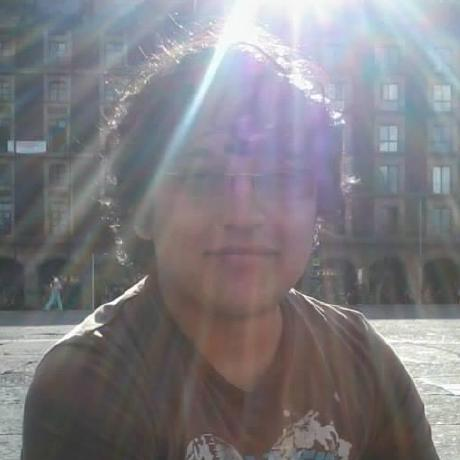

== Humberto de Jesus Flores Acuña

''''

[cols="1",options="headers",width=70%,grid=none,frame=none]
|===
|Computer Engineering +
Tel. +52-1-55-4926-6159 +
hdjesus.flores@gmail.com +
Github: stokekld +
|===

==== Objective

Position myself within the work environment in companies or associations that contain business rules oriented to information technologies, providing my skills on software engineering and use of free software tools, to generate excellent results. Furthermore, I’m looking forward to acquiring experience through the responsibility and confidence deposited in me, achieving an important step in my professional improvement.

//[.left]
//.a title
//image::image.jpg[role="thumb right"]

//Text in next paragraph.

//[cols="2,^"]
//|===
//|Some +
//text

//|
//|===

//==== Education

//[none]
//* FACULTAD DE INGENIERIA, UNAM `_Computer Engineering_`
//+
//A lo largo de mi desarrollo académico en la facultad, he adquirido conocimiento de matemáticas y física asimismo de las diferentes ciencias de la computación, teniendo un fuerte interés en las áreas de Ingeniería de software y Administración de servidores, las cuales me han permitido obtener experiencia laboral.

//====== COLEGIO DE CIENCIAS Y HUMANIDADES (NAUCALPAN) | Certificado 

//[example]
//====
//Pude concluir satisfactoriamente mis estudios de bachillerato, adquiriendo conocimientos sólidos de las principales áreas de la ciencia, además de valores y actitudes que me ayudarían a cursar con éxito mis estudios superiores.
//====

==== Work Experience

[none]
* Bitwise Integrated Technologies `_June 2018 – Present_` +
//`_Ing. Luis David Fernández (Project Leader)_` +
`_IOT Developer_`
+
//====
I'm part of the development of an IOT device for agriculture industry, where my main function was create the communication between device and server and the behavior of device with its harware elements. I achived this work creating a minimum GNU/Linux OS. This OS contained services of systemd that I programmed in C language for manage of MQTT protocol.
//====

[none]
* UCA Consejos Académicos de Área, UNAM `_March 2016 – June 2018_` +
//`_Mtra. Rosario Freixas Flores (Department Chief)_` +
`_Web Developer_`
+
//====
I was present in the development of web applications for the four area councils and in the administration of the servers where such applications are hosted, I am also part of the decision-making process concerning the needs for information technologies in each council.
//====

[none]
* Instituto de Geografía, UNAM `_May 2015 – November 2015_` +
//`_Dr. Adrián Guillermo Aguilar Martínez (Department Chief)_` +
`_Server Administrator_`
+
//====
I performed as the servers administrator and analyst programmer. As an alternate project, I installed the servers: Geoserver and Geonetwork, which are responsible for the cataloguing and distribution of Geospatial data.
//====

<<<

[none]
* SOFTCERT `_July 2014 – March 2015_` +
//`_M.I. Jesús Ulises Acosta Robledo (Project Leader)_` +
`_C Developer_`
+
//====
I was in charge of GNU/Linux servers that made the administration of gas stations. My function was create commands that calculated liquid dispatched and made backups in the database. At the end of the day they sent the sales numbers to PEMEX servers. I programmed the commands in C language paying attention in the security of the servers and its corresponding regulations.
//====

[none]
* DICYG, FACULTAD DE INGENIERÍA, UNAM `_August 2012 - December 2014_` +
//`_M.I. Tanya Itzel Arteaga Ricci (Computer Chief)_` +
`_Intern_`
+
//====
I was part of the team of interns of the Computer Unit of the DICYG, carrying out the role of Programmer Analyst, making systems to measure according to the specific needs of the division, in addition to maintaining existing systems. I also held the position of administrator of the servers where these systems are hosted with their respective databases, likewise I continued to participate slightly in the organization and maintenance of the data network of the building.
//====

[none]
* DICYG, FACULTAD DE INGENIERÍA, UNAM `_January 2012 – June 2014_` +
//`_M.I. Tanya Itzel Arteaga Ricci (Computer Chief)_` +
`_Instructor_`
+
//====
As a complementary activity to that of intern in the Computing Unit of the DICYG, I had the role of instructor collaborating with the training of students of the faculty in the subjects of computation, such as: programming languages oriented to the implementation of operating systems and Web development, as well as operating systems based on GNU / Linux.
//====
[none]
** LINUX OPERATING SYSTEM | Basic | From June 16 to 20, 2014 | Duration: 10 hrs. +
LINUX | Basic | From January 6 to 10, 2014 | Duración: 10 hrs. +
WEB DESIGN WITH PHP AND MYSQL | From January 21 to 25, 2013 | Duration: 15 hrs. +
C PROGRAMMING | Basic | From June 25 to 29, 2012 | Duration: 15 hrs. +
C PROGRAMMING | Basic | From January 9 to 13, 2012 | Duration: 10 hrs.

[none]
* DICYG, FACULTAD DE INGENIERÍA, UNAM `_June 2011 – February 2012_` +
//`_M.I. Tanya Itzel Arteaga Ricci (Computer Chief)_` +
`_Social Service_`
+
The work that I carried out within the division was to provide support and technical guidance for the computer equipment of the chiefs, coordinators, engineers and personnel in general, who work in the different departments that make up the DICYG, also participating slightly in the organization and maintenance of the data network of the building, which has an infrastructure with a high quality standard.

//<<<

[none]
* ECOVIVIENDA `_May 2010 - April 2011_` +
//`_Ing. José de Jesús Ibarra Landeros (Sistems Chief)_` +
`_PHP Developer_`
+
The main activity that I performed in the company was to provide support and development to the modules of the system in charge of the management of all areas of the company (sales, legal, comptroller and administration), as well as participating in the creation of modules. I also solved frequent problems in the data network and provided technical support to computer and office equipment.

==== Education

[none]
* Facultad de Ingeniería, UNAM
[none]
** COMPUTER ENGINEERING | From 2006 to 2012
[none]
* Facultad de Ingeniería, División de Ingeniería Eléctrica
[none]
** LINUX ON EMBEDDED SYSTEMS | From February 5 to June 25, 2016
* Facultad de Ingeniería, Programa de Capacitación en Cómputo de la DICYG
[none]
** RUBY PROGRAMMING | From January 11 to 15, 2016 | Duration: 10 hrs. +
ARCGIS WITH PYTHON | From January 5 to 9, 2015 | Duration: 10 hrs. +
AUTOCAD FOR BEGINNER | From June 9 to 13, 2014 | Duration: 10 hrs. +
PYTHON | Intermediate | From January 20 to 24, 2014 | Duration: 10 hrs. +
PYTHON | Basic | From January 13 to 17, 2014 | Duration: 10 hrs. +
PYTHON PROGRAMMING | From July 22 to 26, 2013 | Duration: 10 hrs. +
DATA NETWORKS| Basic| From July 30 to August 3, 2012 | Duration: 15 hrs.

==== Professional Skills

[none]
* Development
**  PHP, JavaScript, C/C++, Python, Ruby, Golang.
* Web
** HTML5, CSS, AngularJS, ReactJS.
* Framework Web
** Laravel, Django.
* Networking
** IPv4, DHCP, NAT, IPTables.
* Database
** MySQL, PostgreSQL, MongoDB
* OS
** GNU/Linux (Debian, CentOS).
* Server Tools
** Apache, PHP, Mysql, SSH, Cron, Containers(lxc), Docker.
* Version Control
** Git.

==== Additional Skills

[none]
* Responsibility, Honesty, Creativity, Teamwork skills, Ideas for improvement, Logic, Motivation, ability to work under pressure, Confidence.
* Intermediate level of English.
